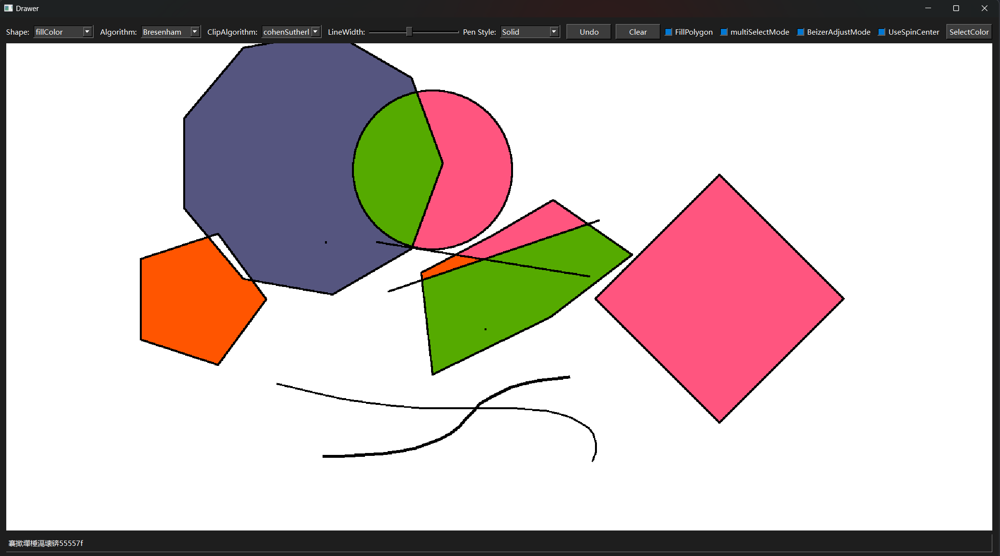

# PaintingBoard Graphics Drawing Tool

> An interactive drawing tool developed with Qt 6, supporting various graphics drawing, editing, transformation, and computer graphics algorithm demonstrations.

---

## Project Overview

**PaintingBoard** is a graphics drawing and editing application built with C++ and the Qt framework. It supports the creation and manipulation of various graphics, including lines, circles, polygons, Bezier curves, and B-spline curves. This project was developed for the Computer Graphics course at Shanghai University.
- The core features of this project include:

- Interactive mouse drawing
- Multiple graphic transformations: translation / scaling / rotation
- Implementation of classic computer graphics algorithms
- Graphic selection, multi - selection, and combined binding operations
- Support for complex functions such as undo, filling, selection, binding, and clipping

---

## Functional Features

### Graphic Drawing

- **Lines**: Supports Bresenham and Midpoint algorithms
- **Circles**: Midpoint circle drawing algorithm
- **Arcs**: Draws arcs based on positive and negative methods
- **Polygons**
  - Freeform polygon drawing
  - Regular polygon (with specified number of sides and radius)
- **Bezier Curves**: Supports arbitrary control points, using the De Casteljau algorithm
- **B-spline Curves**: Supports drawing of B-spline curves with custom - defined degrees

### Graphic Operations

- **Translation**: Supports dragging to translate single and multiple graphics
- **Scaling**: Supports mouse - controlled scaling ratios and custom - defined rotation centers
- **Rotation**: Rotates around a specified rotation center by any angle
- **Undo Operations**: Supports undoing the most recent drawing or transformation
- **Graphic Selection and Multi - selection**: Supports highlighting and batch operations on multiple graphics
- **Graphic Binding**: Supports combined transformation of graphics

### Graphic Clipping

- **Line Clipping**:
  - Cohen - Sutherland algorithm
  - Midpoint division clipping
- **Polygon Clipping**: Sutherland - Hodgman algorithm

### Color Filling Functions

- **Polygon Scan Line Filling**
- **Flood Fill**

---

## User Interface Preview

> Example interface and drawing effects:
> 

---

## Quick Start

### Runtime Environment

|       Item       | Version Requirement |
|------------------|---------------------|
| Operating System |    Windows 10/11    |
| Development Tool |  Visual Studio 2022 |
|      Compiler    |      MSVC (x64)     |
|    Qt Version    |         Qt6.5       |
|   C++ Standard   |         C++14       |

### Compilation and Running

1. Ensure that the Qt development environment is installed (Qt 6.5 + MSVC is recommended)
2. Open the `.sln` project file using Visual Studio 2022
3. Switch to `Release` mode, build and run the project

---

## Operation Guide

### Drawing Process

1. Select the type of graphic (line segment, circle, Bezier, B - spline, polygon, etc.)
2. Use the mouse to click or drag to draw the graphic
3. The drawing of certain graphics (such as freeform polygons and Bezier curves) can be completed with the right button

### Editing and Transformation

- **Selecting Graphics**: Click on or box - select graphics
- **Performing Operations**: After selecting the operation type (such as translation, scaling, rotation), drag the graphic
- **Binding Graphics**: After multi - selecting, right - click to complete the binding
- **Clipping Graphics**: Select the clipping type, then first select the target graphic and draw the clipping area

### Color and Filling

- Any color can be selected as the line color or fill color
- Clicking inside the graphic can fill the area

---

## File Structure

- **PaintWidget.cpp**: Implements the core drawing logic.
- **PaintWidget.h**: Declaration of the `PaintWidget` class.
- **main.cpp**: Program entry point.

---

## Project Improvement Points

- **Chinese Garbled Characters Issue**: In some cases, the program may display Chinese characters as garbled text, and adjustments will be made in the future.
- **Button Layout Issue**: The button layout of the interface needs beautification, and a more reasonable button layout will be redesigned.

## Contribution

- If you have any suggestions or improvements for this project, please feel free to submit an Issue or Pull Request!